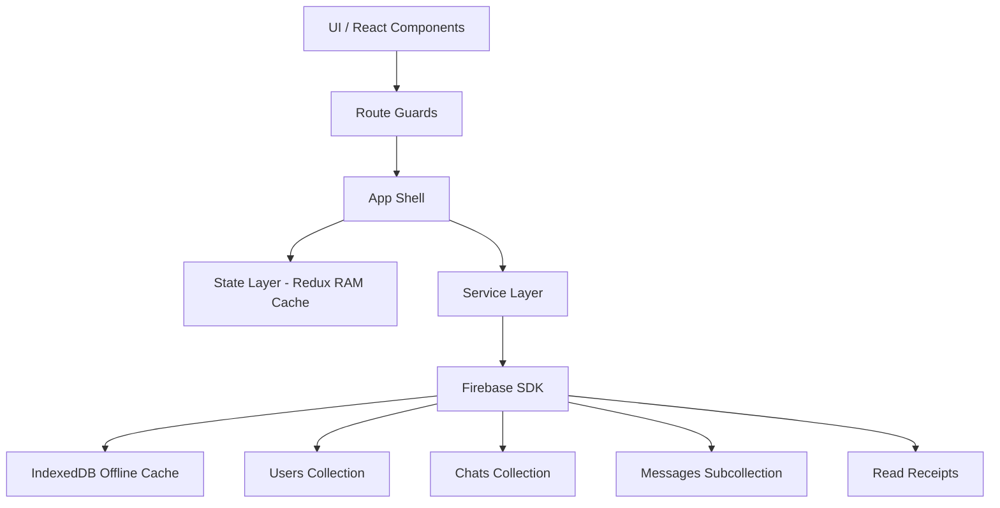
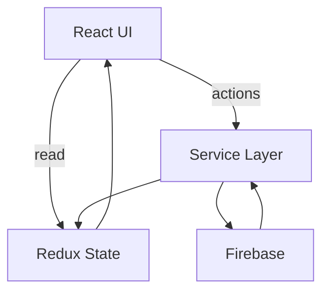

# Achat architecture

1. [File system](#file-system)
2. [Routing](#routing)
3. [User & Data Flow](#user--data-flow)
4. [STATE LAYER](#state-layer)
5. [Service Layer](#service-layer)
6. [Two types of persistence](#two-types-of-persistence)
7. [Architecture system](#architecture-system)
8. [Critical constraints](#critical-constraints-important-for-correctness)
9. [Simple workflow](#simple-workflow)
10. [DB](#db)

## File system

```c#
----/src
    ----/assets
        ----/img
        ----/svg
    ----/components
        // shared
    ----/constants
    ----/firebase
        // config
    ----/hooks
    ----/layouts
    ----/pages
    ----/routing
        // config
        ----/routes
            // restricted, private routes etc.
    ----/services
    ----/redux
        ----/reducers
    ----/styles
    ----/types
    ----/ui
        // ui components (for example: button, input etc.)
    ----/utils
```

## Routing

```
/auth
    /signin
    /signup

/app
    (layout)
        /chats
        /chat/:chatId
    /settings (layout)

```

**Access logic:**
| Route | Access |
|-------|--------|
| /auth/_ | without auth |
| /app/_ | with auth |

**Routes protection**

- user isn't logged in -> redirect /auth/login
- user is logged in -> /app/chats

## User & Data Flow

1. _Chats list (user logged in):_
    - App start
    - Auth check
    - subscribe(chats where userId)
    - store.chats updated
    - UI renders sorted by lastActivity

Notes:

- lastActivity = primary sorting key
- chat list is global subscription (App Shell level)

2. _Open chat (user logged in):_
    - click chat
    - check cache (store.messages[chatId])
    - if empty → attach Firestore subscription
    - subscribe messages(chatId)
    - subscribe reads(chatId)

3. _Send message (user logged in):_
    - user types message
    - optimistic update (store)
    - write Firestore message
    - update chat.lastMessage
    - update chat.lastActivity

4. _Read receipts (user logged in):_
    - open chat
    - update reads/{userId}
    - UI recalculates "read/unread"

## STATE LAYER

Redux is used as runtime cache (RAM layer).

```
auth:
  user

chats:
  items[]
  activeChatId

messages:
  byChatId{
    [chatId]: messages[]
  }

ui:
  loadingStates
  typingIndicators
```

Cache rules:

- Chats:
    - always cached globally
    - updated via onSnapshot
- Messages:
    - cached per chatId
    - lifecycle-bound (enter/leave chat)

## Service Layer

**Responsibilities:**

- subscriptions
- queries
- writes
- normalization

**Example responsibilities:**

```ts
subscribeChats();
subscribeMessages();
sendMessage();
updateLastActivity();
updateReadState();
```

## Two types of persistence

1. Redux (RAM cache)
    - lost on reload
2. Firestore IndexedDB cache
    - survives reload
    - offline support

```
Firestore SDK
IndexedDB (browser)
sync on reconnect
```

**Offline / Reconnect behavior (NEW)**

- _offline:_
    - UI -> Redux cache -> IndexedDB fallback

- _online:_
    - IndexedDB -> Firestore sync -> onSnapshot -> Redux update

## Architecture system



## Critical constraints (important for correctness)

1. Forbidden patterns:
    - Firebase calls inside components directly
    - no cache layer
    - per-message read updates
    - uncontrolled subscriptions
2. Required patterns:
    - single source of truth = Firestore
    - Redux = UI cache only
    - subscriptions = lifecycle-bound
    - read state = cursor-based

## Simple workflow



## DB

```
Firestore (main data)
 ├── users
 ├── chats
    └── messages (subcollection)
    └── reads (subcollection)

RTDB (реaltime signals)
 ├── typing
 └── presence
```

_users_

```ts
users/{userId} {
    username: "daniil",
    phone: "121213"
    createdAt: timestamp,
    lastSeen: timestamp
}
```

role:

- профиль
- lastSeen (No realtime)

_chats_

```ts
chats/{chatId} {
    members: ["user1", "user2"],
    lastMessage: {
        text: "hello",
        userId: "user1",
        createdAt: timestamp
    },
    lastActivity: timestamp,
    createdAt: timestamp,
    type: "private" // or group
}
```

indexes:

- members array-contains
- lastActivity desc

_messages (subcollection)_

```ts
chats/{chatId}/messages/{messageId} {
    text: "hello",
    senderId: "user1",
    type: "text" // "audio"
    createdAt: timestamp,
    edited: true,
    editedAt: timestamp
}
```

rules:

- only append (dont reduct too oft)
- sort by createdAt

_reads (subcollection)_

```ts
chats/{chatId}/reads/{userId} {
    lastReadAt: timestamp
}
```

_typing_

```ts
typing/{chatId} {
    user1: true,
    user2: false
}
```

details:

- oft updates
- ephemeral (temp data)

_presence_

```ts
presence/{userId} {
    state: "online", // offline
    lastChanged: timestamp
}
```

_relations_

```
users ↔ chats (members array)
chats → messages (subcollection)
chats → reads (subcollection)
```


*user for test*
| name | email | password | is verified |
|------|-------|----------|-------------|
|test2|faviver735@dardr.com|1Kl$rtx9|+|
|test3|mebel54446@getasail.com|1Kl$rtx9|+|
|test5|xeheya7715@dardr.com|1Kl$rtx9|+|
|testUser|xales35100@bncinema.com|1234FFgn$123|+|